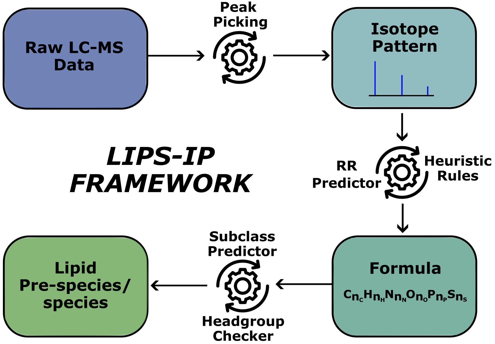

Welcome to LIPS-IP. 

Identification of lipids is a common yet challenging task in mass spectrometry–based
lipidomics, often failing to yield a comprehensive list of identifications. Both quantitative and qualitative downstream analyses are heavily dependent on the results of this
initial identification process. Despite ongoing advancements in computational methods,
a significant portion of screened lipids still remains unidentified. LIPS-IP
is introduced as a method that de novo identifies the species of lipids based on observed
isotope patterns. This approach provides rapid and memory-efficient processing, returning a limited number of lipid species per queried lipid, while ensuring that all steps are
explicitly trackable. With the goal of greatly improving lipidomics workflow efficiency, LIPS-IP processes high resolution LC-MS lipidomics samples independently. It enables
rapid large-scale analyses without requiring extensive tandem mass spectrometry data
acquisition or dependence on lipid databases.

LIPS-IP was developed in Python. However, the mixture models were fitted using the
flexmix package in R and the mass decomposer is implemented in C++. Integration of R functionalities within Python was facilitated using the rpy2 library in Python.
Additionally, C++ executables were invoked using Python’s subprocess module. All code for LIPS-IP, including the theoretical RR, RKMD and headgroup databases, is
available here. 

Use the runner file to do a test run of the example LC-MS sample file. The file is .mzXML and in centroid mode. All steps performed in LIPS-IP are trackable.

